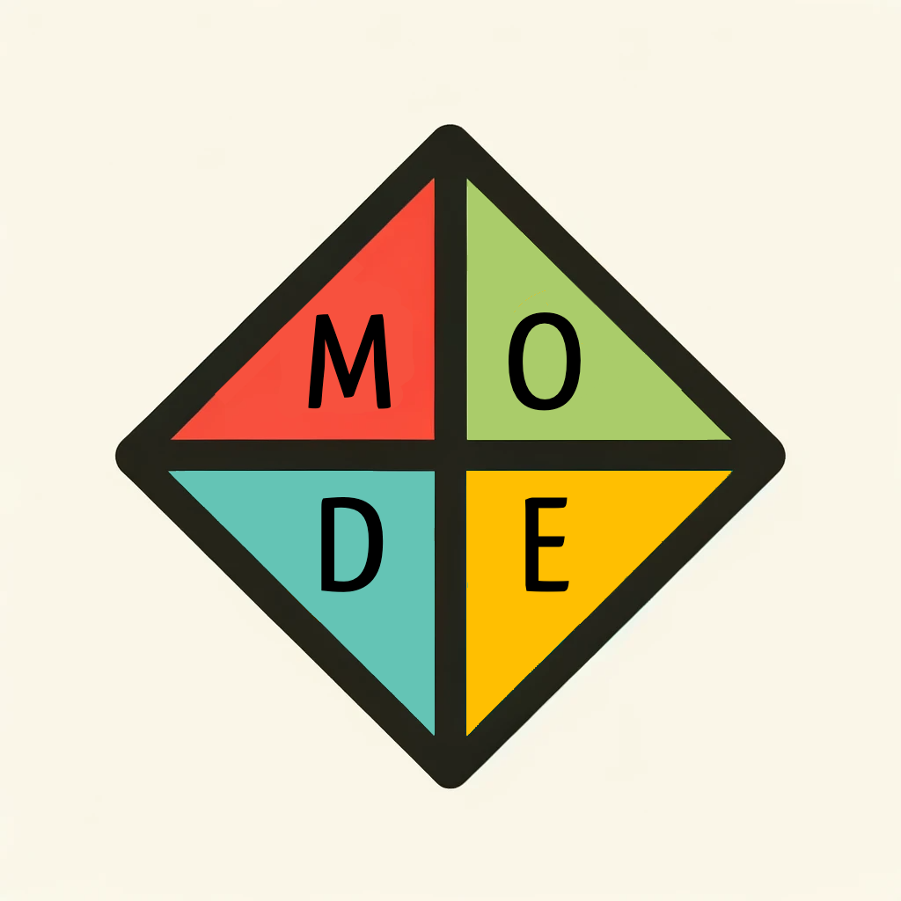

# MODE

## Matt Martinez, Owen Sheow, David Yang, Eric Hwang

## Story/Introduction
MODE is the newest star in the ever evolving landscape of programming languages. Created with 
simplicity in mind, MODE combines features from popular languages like JavaScript and Swift to 
offer a unique blend of both intuitive syntax and powerful functionalities. Through MODE, we hope software 
developers will enter a new realm of possibilites where the boundaries of coding are expanded.

## Features

- Type inference
- Classes
- String interpolation
- Lambda functions
- Optional variables
- Ternary operators

## Example Programs

|                        | JS                                                                                         | Swift                  | MODE                                                               |
| ---------------------- | ------------------------------------------------------------------------------------------ | ---------------------- | ------------------------------------------------------------------ | 
| Type Inference         | let x = 5                                                                                  |                        | auto x = 5                                                         |
| Classes                | class Rectangle { constructor(height, width) { this.height = height this.width = width } } |                        | mode Rectangle(height, width): my.height = height my.width = width |
| String Interpolation   | let name = "Joe" let greeting = `Hello ${name}`                                            |                        | auto name = "Joe" auto greeting = %"Hello (name)"                  |
| Arrow/Lambda Functions | const add = (a, b) => a + b                                                                |                        | auto add = a, b returns a + b                                      |
| Optional Variables     |                                                                                            | var number: Int? = nil | auto maybe number = Null                                           |
| Ternary Operators      | let result = a > b ? "a is greater" : "b is greater"                                       |                        | auto result = a > b then "a is greater" else "b is greater"        |
